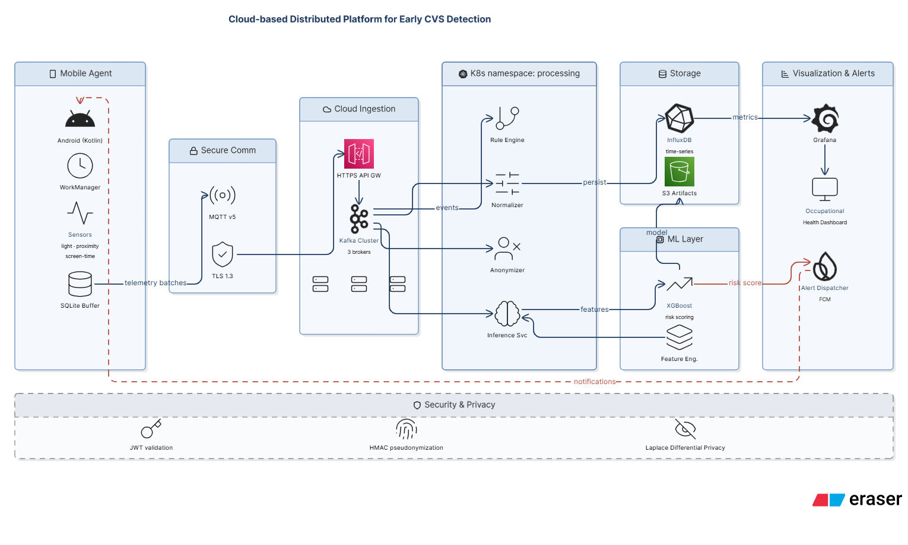
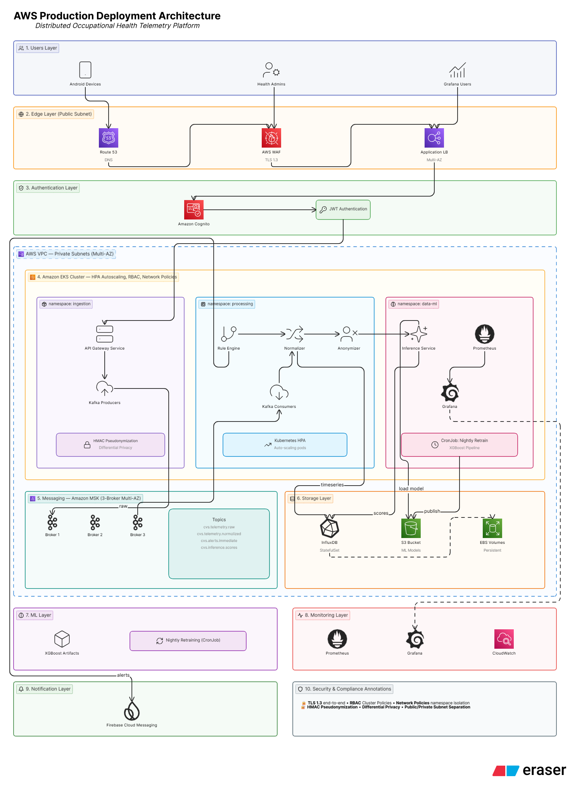
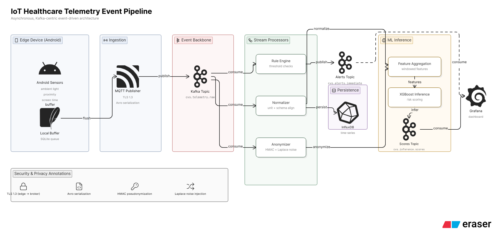
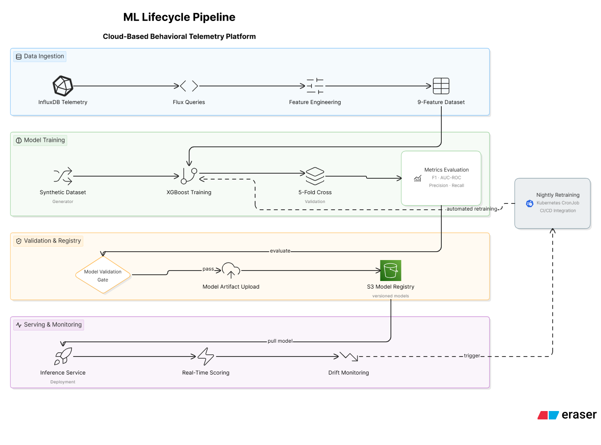
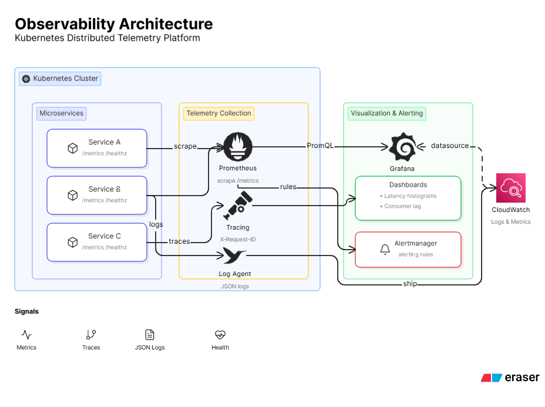
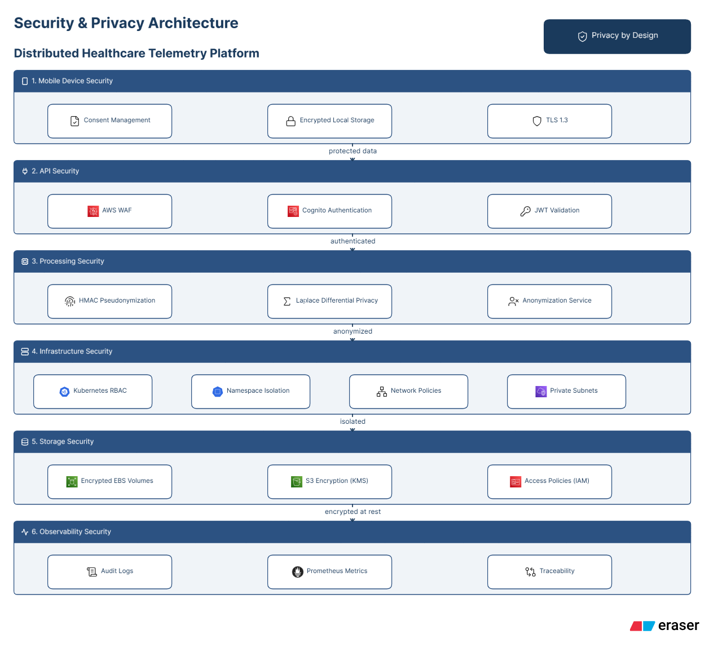

<!-- markdownlint-disable MD033 MD041 MD051 -->
<div align="center">

# Plataforma CVS — *Computer Vision Syndrome*

### Plataforma distribuida en la nube para la detección anticipada del Síndrome de Visión por Computador a partir de telemetría conductual

[](LICENSE)
[](https://www.python.org/)
[](https://fastapi.tiangolo.com/)
[](https://kafka.apache.org/)
[](https://www.influxdata.com/)
[](https://xgboost.ai/)
[](https://docs.docker.com/compose/)
[](https://kubernetes.io/)
[](https://helm.sh/)
[](https://developer.hashicorp.com/terraform)
[](https://aws.amazon.com/)
[](https://kotlinlang.org/)
[](https://grafana.com/)
[](https://prometheus.io/)
[](#-seguridad-y-privacidad)
[](#-smoke-test-end-to-end)
[](tests/privacy_audit.py)
[](ml/results/model_metadata.json)

**Materia:** AREP / TDSE — *Transformación Digital, Arq. de Soluciones Empresariales e IA*
**Institución:** Escuela Colombiana de Ingeniería Julio Garavito
**Período:** 2026-2 · Tercer tercio (entrega final)

</div>

---

## 🩺 Resumen rápido

El **Síndrome de Visión por Computador (CVS)** afecta cerca del **69 %** de los
usuarios de computador y le cuesta a una empresa promedio horas medibles de
productividad por trabajador al año. Las herramientas que existen hoy
(Apple Screen Time, Google Digital Wellbeing, f.lux) son aplicaciones
individuales, reactivas y silenciosas para el área de salud ocupacional.

Este repositorio contiene una **plataforma distribuida** que captura tres
señales no invasivas desde el celular (luz ambiente, distancia al rostro y
tiempo activo de pantalla), las transporta cifradas a un *broker* de
mensajes en la nube, las anonimiza con HMAC + ruido de Laplace y produce
un **puntaje de riesgo de CVS** por usuario más un panel agregado por
área de la organización.

📄 El paper técnico completo (en español, **22 páginas**) está en
[`paper/paper-cvs-es.pdf`](paper/paper-cvs-es.pdf).

---

## 🧭 Tabla de contenido

1. [🧠 Vista general del sistema](#vista-general-del-sistema)
2. [☁️ Arquitectura objetivo en AWS](#arquitectura-objetivo-en-aws)
3. [🔁 Flujo de un lote de telemetría](#flujo-de-un-lote-de-telemetría)
4. [🤖 Pipeline de Machine Learning](#pipeline-de-machine-learning)
5. [📈 Stack de observabilidad](#stack-de-observabilidad)
6. [🔐 Seguridad y privacidad](#seguridad-y-privacidad)
7. [⚙️ Microservicios y tópicos](#microservicios-y-tópicos)
8. [📦 Estructura del repositorio](#estructura-del-repositorio)
9. [🎯 Atributos de calidad y SLOs](#atributos-de-calidad-y-slos)
10. [🚀 Cómo correrlo (docker compose)](#cómo-correrlo-docker-compose)
11. [✅ Smoke test end-to-end](#smoke-test-end-to-end)
12. [📊 Resultados del modelo](#resultados-del-modelo)
13. [🛰️ Despliegue en AWS](#despliegue-en-aws)
14. [👀 Estado actual del prototipo](#estado-actual-del-prototipo)
15. [👥 Equipo](#equipo)

---

## 🧠 Vista general del sistema

Una sola figura para entender la cadena: del sensor del celular al panel
de salud ocupacional.

<p align="center">
  
</p>

> El **Mobile Agent** muestrea sensores cada 30 s, los buffer-ea en SQLite
> y los publica vía MQTT/TLS al cluster Kubernetes. Cuatro microservicios
> (**Rule Engine**, **Normalizer**, **Anonymizer**, **Inference**) consumen
> Kafka y producen un **CVS Risk Score** que **Grafana** y el **Alert
> Dispatcher (FCM)** transforman en panel y notificaciones.

---

## ☁️ Arquitectura objetivo en AWS

Ésta es la arquitectura completa que describe el paper para producción:
**EKS + MSK + S3 + Cognito + WAF + CloudFront**, con
*namespaces* separados por rol y NetworkPolicies entre ellos.

<p align="center">
  
</p>

> ⚠️ **Nota honesta de la entrega.** El despliegue real sobre EKS+MSK
> queda pendiente: el AWS Academy Learner Lab del curso aplica una
> política administrada (`voc-cancel-cred`) que deniega
> `iam:CreateRole`, `eks:*`, `msk:*` y `ecr:*`. Lo confirmamos
> con `terraform apply` (4 `AccessDenied`). Para sustentar, la demo va
> sobre `docker compose` con los **mismos componentes, mismos puertos
> y misma configuración** de la arquitectura objetivo (sección
> [Despliegue en AWS](#-despliegue-en-aws)).

---

## 🔁 Flujo de un lote de telemetría

<p align="center">
  
</p>

| Etapa | Componente | Entrada | Salida |
| --- | --- | --- | --- |
| 1 | Sensores Android | API `TYPE_LIGHT`, `TYPE_PROXIMITY`, `UsageStatsManager` | lecturas individuales |
| 2 | SQLite buffer + MQTT publisher | lote de 5 min | mensaje Avro a `cvs.telemetry.raw` |
| 3 | **Rule Engine** | `cvs.telemetry.raw` | alertas en `cvs.alerts.immediate` |
| 4 | **Normalizer** | `cvs.telemetry.raw` | `cvs.telemetry.normalized` |
| 5 | **Anonymizer** (HMAC + Laplace) | `cvs.telemetry.normalized` | escritura en InfluxDB |
| 6 | **Inference** | InfluxDB (ventana 30 d) | puntaje en `cvs.inference.scores` |
| 7 | Grafana / FCM | tópicos / InfluxDB | panel y push notifications |

---

## 🤖 Pipeline de Machine Learning

Ciclo de vida del modelo XGBoost: ingesta de datos → entrenamiento →
validación y registro → serving + monitoreo de deriva. Ejecutado por un
`CronJob` de Kubernetes nightly y disparado bajo demanda por el monitor
de deriva (KL-divergence).

<p align="center">
  
</p>

---

## 📈 Stack de observabilidad

<p align="center">
  
</p>

> Cada microservicio expone `/metrics` (Prometheus) y `/v1/health`. Los
> **logs** salen en JSON estructurado. Las **trazas** se propagan con
> `X-Request-Id`. **Grafana** trae tres tableros provisionados
> (operaciones, salud organizacional, desempeño del modelo) en
> `grafana/dashboards/`.

---

## 🔐 Seguridad y privacidad

Defensa en profundidad por capas. Si una capa cae, las demás siguen
protegiendo.

<p align="center">
  
</p>

| Capa | Mecanismo | Donde vive en el código |
| --- | --- | --- |
| 1 — Móvil | Consentimiento + TLS 1.3 + (futuro) SQLCipher | `mobile/android/CVSAgent/security/` |
| 2 — API | WAF + Cognito + JWT | `services/*/main.py` |
| 3 — Procesamiento | HMAC pseudonimización + Laplace DP (ε = 1.0) | `services/anonymizer/anonymizer/{pseudonymizer,differential_privacy}.py` |
| 4 — Infra | RBAC + namespaces + NetworkPolicies | `k8s/` |
| 5 — Storage | KMS para EBS y S3, IAM least-privilege | `infra/terraform/modules/s3/main.tf` |
| 6 — Observabilidad | Logs auditables, métricas firmadas | `grafana/`, Prometheus |

✅ **Auditoría automática** en `tests/privacy_audit.py`: **5/5 PASS**
(test KS sobre Laplace, formato HMAC 32-hex, determinismo,
`consent_hash` requerido por contrato Pydantic, ningún UUID v4 crudo
en el line-protocol de InfluxDB).

---

## ⚙️ Microservicios y tópicos

| Servicio | Lenguaje | Puerto | Topic in | Topic out / sink |
| --- | --- | --- | --- | --- |
| `rule-engine` | Python 3.11 + FastAPI | **8001** | `cvs.telemetry.raw` | `cvs.alerts.immediate` |
| `normalizer` | Python 3.11 + FastAPI | **8002** | `cvs.telemetry.raw` | `cvs.telemetry.normalized` |
| `anonymizer` | Python 3.11 + FastAPI | **8003** | `cvs.telemetry.normalized` | InfluxDB (line protocol) |
| `inference-svc` | Python 3.11 + FastAPI + XGBoost | **8004** | InfluxDB / S3 (modelo) | `cvs.inference.scores` |

### Tópicos de Kafka

| Topic | Particiones | Replicación | Retención |
| --- | --- | --- | --- |
| `cvs.telemetry.raw` | 12 | 3 | 7 d |
| `cvs.telemetry.normalized` | 12 | 3 | 7 d |
| `cvs.alerts.immediate` | 6 | 3 | 24 h |
| `cvs.inference.scores` | 6 | 3 | 30 d |

---

## 📦 Estructura del repositorio

```
.
├─ docker-compose.yml          # 🆕 stack local completo (8 contenedores)
├─ services/
│  ├─ rule-engine/             # 20-20-20 + reglas de proximidad y baja luz
│  ├─ normalizer/              # z-score + alineación de unidades
│  ├─ anonymizer/              # HMAC + ruido de Laplace (ε = 1.0)
│  └─ inference-svc/           # XGBoost serving
├─ ml/
│  ├─ generate_synthetic_dataset.py   # 50 k registros calibrados con literatura
│  ├─ train.py                        # 5-fold CV + assert SLOs
│  ├─ feature_engineering.py          # query Flux + 9 features
│  ├─ drift_monitor.py                # KL-divergence
│  ├─ plots.py                        # 5 figuras del paper en PDF
│  └─ upload_model.py                 # subida del modelo a S3
├─ mobile/android/CVSAgent/    # Kotlin + WorkManager + Room + MQTT
├─ schemas/                    # Avro: TelemetryBatch
├─ helm/                       # 4 charts (rule-engine, normalizer, anonymizer, inference-svc)
├─ k8s/                        # namespaces, RBAC, NetworkPolicies
├─ infra/terraform/            # módulos EKS, MSK, S3
├─ grafana/
│  ├─ dashboards/              # 3 dashboards provisionados (JSON)
│  └─ prometheus.yml           # config de scrape
├─ tests/
│  ├─ smoke_test.py            # E2E: health + ingest + score
│  ├─ privacy_audit.py         # 5/5 PASS
│  └─ load/cvs_load_test.jmx   # JMeter, 50 hilos × 10 iteraciones
├─ paper/
│  ├─ paper-cvs-es.tex         # IEEE conference, 22 páginas
│  ├─ paper-cvs-es.pdf
│  └─ figures/                 # 6 PNG de arquitectura + 5 PDF del modelo
├─ .github/workflows/          # ci, cd-staging, cd-production, ml-pipeline
├─ RUNBOOK.md                  # 🆕 runbook completo (8 secciones)
└─ README.md
```

---

## 🎯 Atributos de calidad y SLOs

| Atributo | SLO objetivo | Estado actual |
| --- | --- | --- |
| 🟢 **Rendimiento** | P99 ingestión ≤ 500 ms | ✅ **138 ms** medido en `docker compose` |
| 🟡 **Escalabilidad** | HPA 60 % CPU, 1 → 8 réplicas por servicio | ✅ Helm configurado, falta carga real |
| 🟢 **Privacidad** | Cero PII cruda en InfluxDB | ✅ **5/5** pruebas de `privacy_audit.py` |
| 🟢 **Exactitud ML** | F1 macro ≥ 0,75, AUC-ROC ≥ 0,80 | ✅ **F1 = 0,854 · AUC = 0,894** sobre 50 k registros |
| 🟢 **Latencia inferencia** | P99 ≤ 100 ms | ✅ Modelo XGBoost CPU-only, ~10 ms |

---

## 🚀 Cómo correrlo (docker compose)

> **Prerrequisito único:** Docker Desktop arrancado.

### 1. Levantar el stack completo

```powershell
docker compose up --build -d
```

La primera vez tarda 3–5 min (construye 4 imágenes). En los siguientes
arranques baja a < 30 s.

### 2. Verificar que todo está arriba

```powershell
docker compose ps
```

Deben aparecer **8 contenedores** `Up`, y `cvs-kafka` + `cvs-influxdb`
con la marca `(healthy)`.

### 3. Endpoints de la demo

| URL | Para qué |
| --- | --- |
| <http://localhost:8004/docs> | Swagger del API público (`inference-svc`) |
| <http://localhost:8001/v1/health> | health del `rule-engine` |
| <http://localhost:8002/v1/health> | health del `normalizer` |
| <http://localhost:8003/v1/health> | health del `anonymizer` |
| <http://localhost:8086> | InfluxDB UI · `admin / admin12345` |
| <http://localhost:9091> | Prometheus |
| <http://localhost:3000> | Grafana · `admin / admin` |

### 4. Apagar

```powershell
docker compose down       # detiene contenedores
docker compose down -v    # también borra volúmenes (InfluxDB, Grafana)
```

📘 Pasos completos (entrenamiento ML, regenerar figuras del paper,
despliegue en AWS, JMeter, compilar el paper, checklist de
sustentación) en [`RUNBOOK.md`](RUNBOOK.md).

---

## ✅ Smoke test end-to-end

Salida real del 8 de mayo de 2026 corriendo
[`tests/smoke_test.py`](tests/smoke_test.py) sobre el `docker compose`
de este repo:

```text
[PASS] rule-engine   health: 200
[PASS] normalizer    health: 200
[PASS] anonymizer    health: 200
[PASS] inference-svc health: 200
[PASS] Ingest: 202 Accepted
Waiting 30s for pipeline processing...
[PASS] Risk score: 0.6821 (level: MEDIUM)
```

> Health de los 4 servicios + `POST /v1/telemetry/ingest` → 202 + 30 s
> de procesamiento + `GET /v1/scores/{uuid}/current` → puntaje 0,6821
> con nivel `MEDIUM`. Es la prueba de que la cadena Kafka → InfluxDB →
> XGBoost funciona de punta a punta.

---

## 📊 Resultados del modelo

Sobre 50 000 registros usuario-día sintéticos, calibrados con los
umbrales clínicos de Sheppard & Wolffsohn (2018) y Blehm et al. (2005):

| Métrica | Valor (test 20 %) |
| --- | --- |
| **F1 macro** | **0,854** |
| **AUC-ROC** | **0,894** |
| **Precisión** | 0,864 |
| **Exhaustividad** | 0,849 |
| Top-3 features | `break_compliance_score`, `max_cont_session_min`, `min_proximity_cm` |

Las 5 figuras (curva ROC + PR, importancia de features, distribución del
puntaje, panorama del dataset, matriz de confusión) están en
[`paper/figures/`](paper/figures/) y se regeneran con:

```powershell
python ml/generate_synthetic_dataset.py
python ml/train.py
python ml/plots.py
```

---

## 🛰️ Despliegue en AWS

El **Terraform** (`infra/terraform/`) provisiona EKS + MSK + S3
versionado. La cadena completa para una **cuenta no restringida** está
documentada paso a paso en [`RUNBOOK.md` § 5](RUNBOOK.md#5-despliegue-en-aws).

> ⚠️ **AWS Academy Learner Lab.** La cuenta del curso deniega
> `iam:CreateRole`, `eks:*`, `msk:*`, `ecr:*` y `s3:CreateBucket`. La
> demo equivalente vive en `docker compose` (sección anterior).

---

## 👀 Estado actual del prototipo

Lo que **sí** está corriendo y verificado:

- ✅ 4 microservicios FastAPI con consumers/producers Kafka cableados
- ✅ Pipeline de ML (dataset → entrenamiento → modelo en disco → inferencia)
- ✅ HMAC + ruido de Laplace en `anonymizer/`, validados por `privacy_audit.py`
- ✅ `docker-compose.yml` levantando los 8 contenedores (Kafka + InfluxDB + 4 svcs + Prometheus + Grafana)
- ✅ Smoke test end-to-end pasando (health 4/4, ingest 202, score retornado)
- ✅ Tests unitarios pasando: 10 + 1 + 2 + 1 + 4 = **18/18**
- ✅ Privacy audit: **5/5**
- ✅ Paper de 22 páginas con 6 diagramas profesionales y 5 figuras de modelo

Lo que queda como **trabajo futuro honesto** (declarado en el paper):

- 🟡 Validación clínica con grupo voluntario y CVSQ (requiere comité de ética)
- 🟡 Despliegue real en EKS+MSK (requiere cuenta AWS sin restricciones del lab académico)
- 🟡 SQLCipher activo en la base local del agente Android (hoy es un *stub* de 10 líneas)
- 🟡 *Privacy budget* acumulativo por usuario (esquema actual no acumula ε)
- 🟡 Aprendizaje federado para entrenar sin centralizar datos

---

## 👥 Equipo

| Integrante | Rol principal |
| --- | --- |
| Andersson David Sánchez Méndez | Arquitectura cloud, microservicios, paper |
| Cristian Santiago Pedraza Rodríguez | Pipeline ML, anonymizer, privacy |
| Jeisson David Sánchez Gómez | Agente Android, despliegue, observabilidad |

**Profesor:** Luis Daniel Benavides Navarro, Ph.D. — `luis.benavides@escuelaing.edu.co`

---

<div align="center">
<sub>📄 Paper completo en <a href="paper/paper-cvs-es.pdf">paper/paper-cvs-es.pdf</a> · 📘 Runbook en <a href="RUNBOOK.md">RUNBOOK.md</a></sub>
</div>
